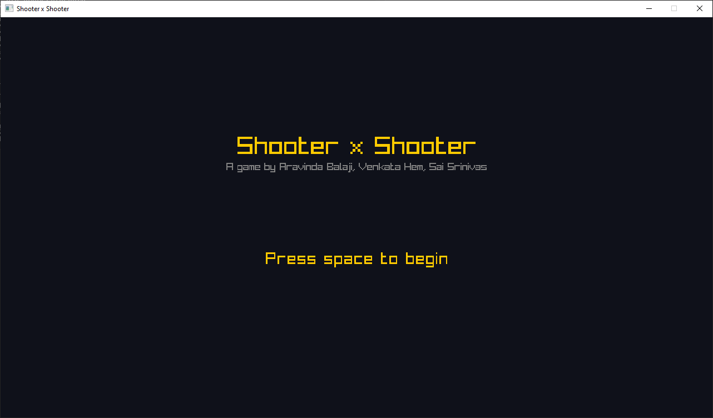

# Shooter x Shooter

## A minimal videogame created using [Raylib-J](https://github.com/CreedVI/Raylib-J "GitHub - CreedVI/Raylib-J: Handmade Java binding for Raylib") and Java

### Rules of the Game:

- Collect five "Bullet Pieces" to form a bullet
  
- Aim and take the shot
  
- Shoot all targets in the minimal amount of time
  
- Try to beat your own time and break into the leaderboard !!🤠

### Screenshots  

### Created by

- Aravinda Balaji K
  
- Venkata Hem DK
  
- Sai Srinivas
